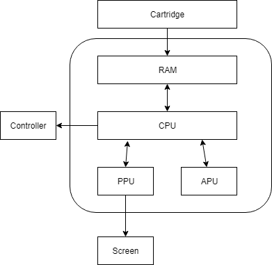

## Emulating hardware using software

Fundamentally, a emulator is a software that attempts to replicate the behavior of hardware.

In theory, one can build a simulator that exactly replicates the hardware behavior on transistor level. For example, [visual6502.org](http://visual6502.org/) has [javascript based simulation](https://github.com/trebonian/visual6502) that simulates 6502 CPU in this manner.

One can imagine once you have the entire hardware mapped out to transistors as a table, the entire simulation can be completely table driven. However, it is probably not too hard to imagine such approach might not have desirable performance. And writing such code and debugging such tables is going to be extremely hard. Just imagine - you are no longer debugging code, but actually debugging your table to find the 'missing/incorrect wire', making this impractical for most emulation authors, other than the electronic hacker/software engineer wizard. Such people are rare these days (I'm certainly not one of them).

The more common approach is to replicate only the behavior that is observable to the software (the games) and the player. Basically, given the input, you'll need to implement the middle blackbox that gives the exact output.



Let's take a look at what happens when you insert a cartridge into the system:

* Cartridge maps its ROM contents into RAM / 16-bit address space

* CPU starts running code

* Code wait for the PPU to initialize

* Code starts to read its CHR ROM and write data into PPU to show you a title screen

* Code starts to read its ROM data and writes to APU registers - this gets you the wonderful 8-bit sound

* Code waits for your input to make selection and start in the title screen

* Once you press start, game loads more data into PPU, run the main game loop, and respond to your inputs accordingly

There are a lot of steps here. But it's easy to see that CPU is really the main one that drives the execution. Even though other components also does its own function - they are fundamentally driven by interaction with the CPU. Player interaction with the system is also through the controller which only CPU can interact and read its value. Put in other words, CPU is the brain. 

## Timing is everything

There is one more thing that isn't obvious if you haven't thought about it before - all the hardware (CPU, APU, PPU) runs in parallel. They communicate to each other in real time, run at their own pace that is proportional to a "master clock", and go about doing its work:

* For CPU, it means executing instructions. 

* For PPU, it means drawing background and sprites based on PPU RAM. 

* For APU, it means output square waves using values set from registers, etc. 

If such pacing are not emulated, programs might not work correctly, when they expect certain order of events when running in real hardware.

You might think those programmers back in the days are code wizards that are doing these things to simply show off their programming chops. But this is not the case.

In the NES days, every game runs at 60fps, and programmers only have so much time to update their screen each frame, and they have to carefully count their instructions to fit in the narrow window to update the background / sprites. By counting I literally mean bring out a huge referencec manual, calculate how long each instruction takes, and add them all together. In cases where they accidentally run more than needed, frames can be skipped causing slowdowns. Even today's game struggle to render 60 frames per second - if you think about it, you only have about 16ms to update each frame - and that's not a lot of time. And try that in a 1.7MHZ CPU (it's not a typo) in the 80s.

Some games also try to fully utilize (in other words, one might say abuse) limited processing power to do interesting effects, such as changing scrolling parameters mid-frame so that status bar doesn't move, etc. All these require timing to be accurate enough for those programs to function - you need to change the scrolling parameter exactly when PPU is drawing that scanline. Of course, there are straight-forward games that doesn't depend on timing that much (like the early titles). But if you want your emulator to run as many games as possible, you'll need to worry about it.

## Implementing the timing

In terms of implementation, there are a few approaches as far as I can tell. Not all of them are good approaches - I'm simply listing them for thoughts experiment:
 
### Using dedicated cores for each hardware component running in parallel

As discussed before, imagine if you have dedicated cores for each component and they can be guaranteed to be run in parallel without being interrupted by other threads.

Do keep in mind that code running on each core doesn't run exactly at the correct hardware speed - they need to be synchronized to an internal clock cycle. For best accuracy, you might need to synchronize *every* cycle, or you can relax it to every X number of cycles (or the next important cycle). In practice this can be implemented as a common counter shared by all cores and checking counter every step of the way - and keep spinning if the counter isn't what is expected.

However, in practice this is rarely done because not every one has enough cores to dedicate to run your best NES emulator ever. You need at least 3 cores (CPU, PPU, APU). This means user would have at least 4 cores. And for every subcomponent (for example, PPU also have its own subchannels that runs their own pace), you also might need additional cores (or take a hybrid approach - see below). In a dedicated hardware such as consoles, such approach might be acceptable. But in PCs today it is rarely worth it. Maybe in some day when everybody has 16 cores. Maybe.

### Running all components in one thread, one cycle at a time

Essentially, this is multi-threading in a single-thread. Every component gets a slice of time to execute, and yield to the next component when it finishes the work for exactly one cycle. Rinse and repeat.

This doesn't look bad on the surface, until you realize operations typically take more than one cycles to complete. Take CPU instructions for example - CPU instructions take multiple cycles, depending on many different factors (which adderss mode it is using, which instruction it is, etc). You need to be able to *suspend* mid-instruction, and *resume* running the instruction. This usually means maintain each instruction itself as an table of steps, and maintaining which instruction you are in and which step it is, as if the entire CPU is a finite state machine.

For example, ADC instruction (add with carry) with absolute address (16-bit address) is on a high-level consists of a few steps:

    * fetch opcode (ADC), PC++

    * fetch low-byte (for 16-bit addr), PC++

    * fetch high-byte (for 16-bit addr), PC++

    * read from address, PC++

Interestingly, having state machines that allow suspension/resume isn't new. Many languages/compilers are adding support for async/await pattern which solves this exact problem - await become suspension points that program can suspend and then resume when the pending operation is complete. The compiler is repsonsible for generating the state machine. Imagine if the async/await infra is augmented to understand clock cycles, and it'll suspend if the desired cycles are already met. I haven't explored this approach further, but I can imagine there are ways to make it work in C++ using C++ coroutines.

The more straight-forward approach (though tedious) is to implement each step as a operation, and manually maintain a state machine that knows the current instruction and the index to the current operation inside the instruction, and execute one operation at a time. This is not that different than compiler generated suspend/resume state machine, except you'll need to hand craft it.

### Run CPU one instruction at a time, other components catch up

This one is very similar to the last one - each component execute one unit of work at a time that takes T time, and other component tries to do as much work possible to fix into time T,, and advance its internal clock. Given that CPU is the one running programs, it is natural for the CPU to be the one that execute one instruction at a time, advance its internal clock, and ask everybody else to catch up to the CPU's internal clock.

This is obviously less accurate since the operations are clumped together in one "big" cycle, but is usually good enough, until you run into cases where certain components needs to observe state somewhere within T. This can be mitigated by logging the state changes (but don't apply them yet), and compare the state access with the log to determine whether the state change should be visible up to what point. And apply them when all components are done. This is somewhat similar to a transactional processing system where all changes are logged and applied at the end of transaction (one CPU instruction) - changes are only visible to other components if they have advanced to a certain point after the change is made. Of course, here there is no isolation as everybody can see what everybody else is doing. 

The real implementations tends to be much more messier. Most emulators tend to follow the "catch up" approach which is the easiest to implement.

## Writing the main loop

The approach I take in NESChan is a hybrid approach. The main loop drives one cycle at a time - and it's up to each component to decide the cycle granularity of its work.

`nes_system` keeps track of the master clock which all components synchronize to. You call `step(1)` to advance one cycle at a time, and each component catches up to that master clock.

```c++

void nes_system::step(nes_cycle_t count)
{
    _master_cycle += count;

    _cpu->step_to(_master_cycle);
    _ppu->step_to(_master_cycle);
}

```

Internally, every component decides how it advances its internal clock to the master clock.

For PPU, it can support cycle granuity due to the way it is implemented - it is a giant hand written state machine that replicates exactly what hardware does in each PPU clock cycle. We'll get into more of that in a future post.

For CPU, given that I haven't implemented CPU instructions using arrays (I might have to do that at some point), CPU runs one instruction at a time and advance the clock with the amount of cycles that the instruction took. This means the CPU can overshot the master clock. When the CPU get a step_to call next time, it'll do nothing until it catches up to master clock and execute another instruction. 

```c++

void nes_cpu::step_to(nes_cycle_t new_count)
{
    // we are asked to proceed to new_count - keep executing one instruction
    while (_cycle < new_count && !_system->stop_requested())
        exec_one_instruction();    // This advances the cycles
}

```

Obviously this can be further optimized, but in practice this works reasonably well that I didn't find it necessary to optimize.

## What's next

In the next post, I'll be talking about how NES 6502 CPU works, and how to emulate its instructions. It's mostly pretty straight-forward, if not a bit tedious. The addressing mode and memory layout is probably the most interesting part.